# Build guide

## 1 Cutting parts

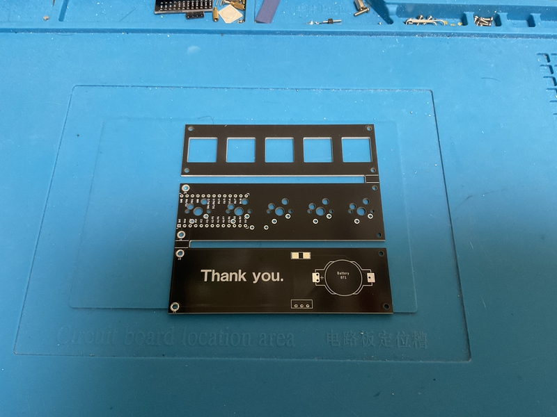

Use nippers to cut the board into three pieces.
 
ニッパーなどを使い、基板を３つに切り分けましょう。
 

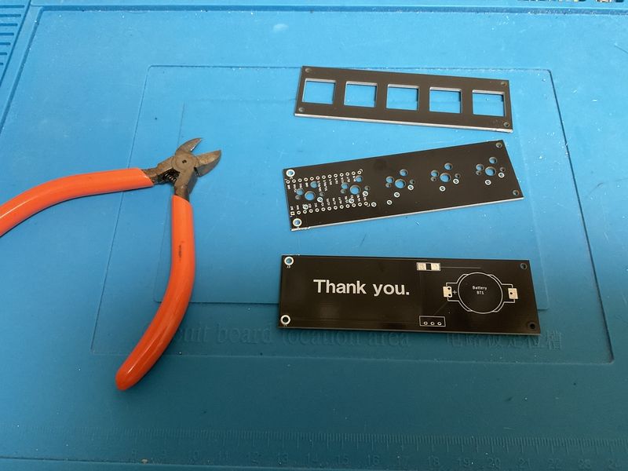

File the cut section.
 
切り取った断面をやすりがけしましょう。
 

Some versions are already cut out.
 
既に切り分けられているバージョンもあります。
 

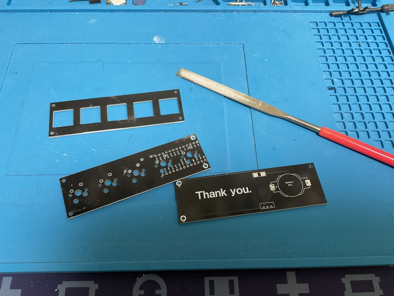

Paint the sides of all the boards with a black pen for a clean finish.
 
全ての基板の側面を黒色ペンで塗ると綺麗に仕上がります。
 
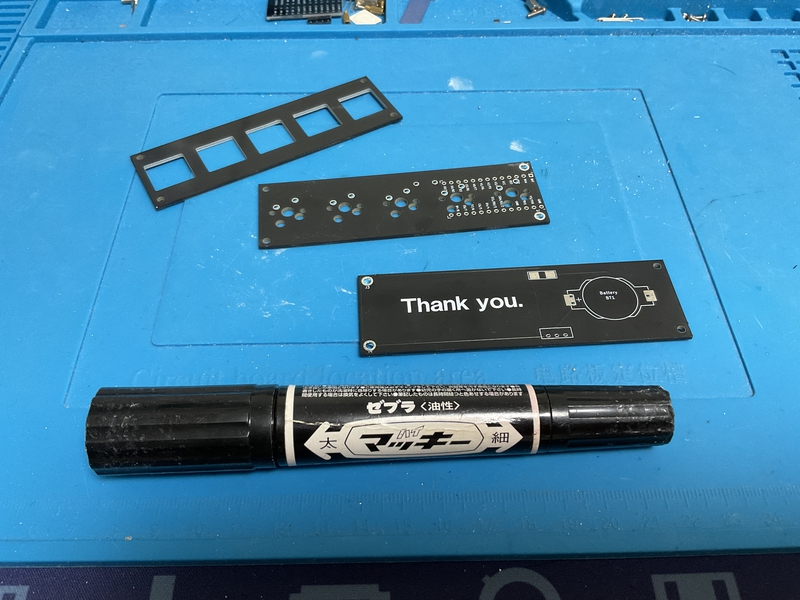

## 2 Soldering switch socket

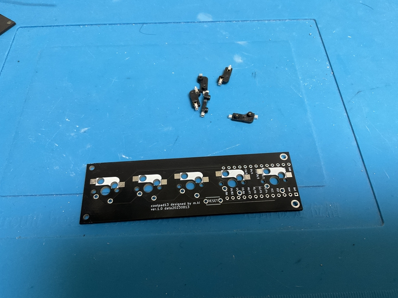

Apply solder to one side of the terminal.
 
端子の片側にハンダを盛りましょう。
 

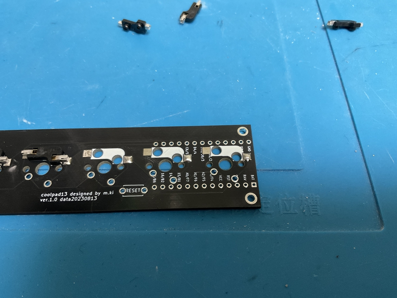

Let's put the switch socket on the board according to the silk and solder it.
 
基板のシルクに合わせてスイッチソケットを乗せて、ハンダ付けしましょう。
 

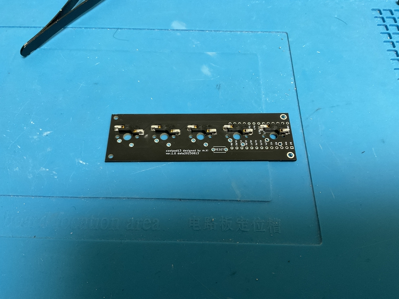

## 3 Soldering tact switch

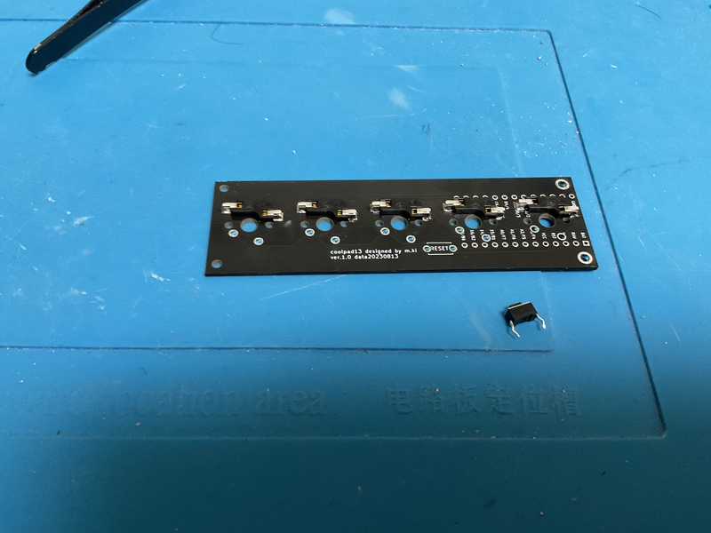

Insert the tact switch into the side where you soldered the switch socket, and solder it on the other side.
 
スイッチソケットをハンダ付けした面に、タクトスイッチを差し込んで、反対の面でハンダ付けしてください。
 

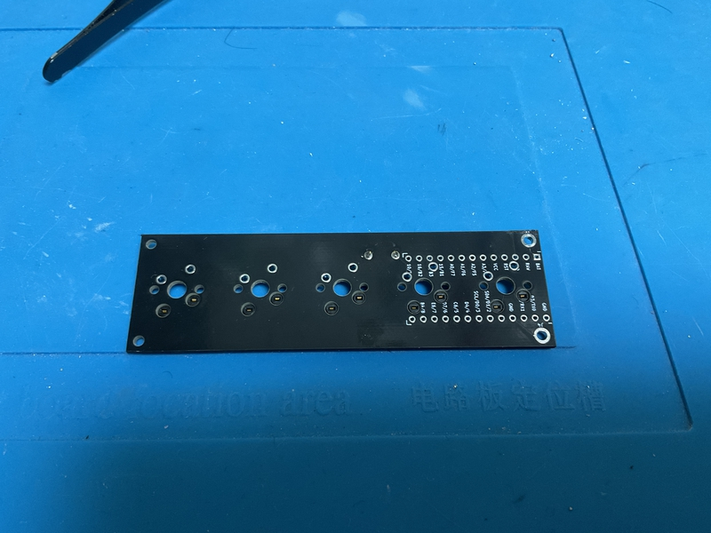

## 4 Soldering battery part

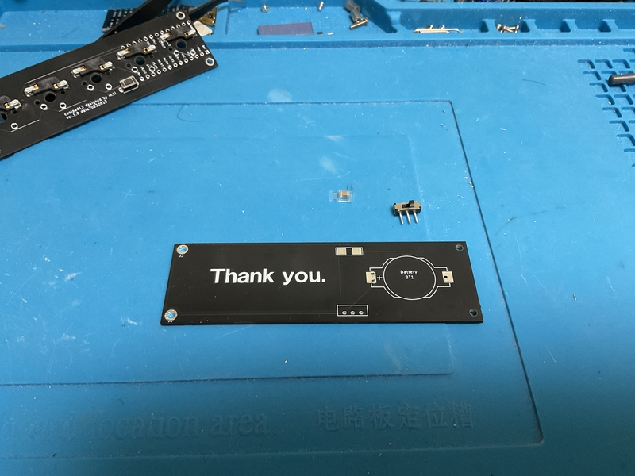

Install the capacitor and horizontal slide switch first. You can successfully solder a capacitor by applying solder to one side of the terminal, placing the capacitor, and melting the solder.
 
最初にコンデンサと水平スライドスイッチを取り付けます。コンデンサは、端子の片側にハンダを盛ってから、コンデンサを置き、ハンダを溶かすようにすると、上手にハンダ付けできます。
 

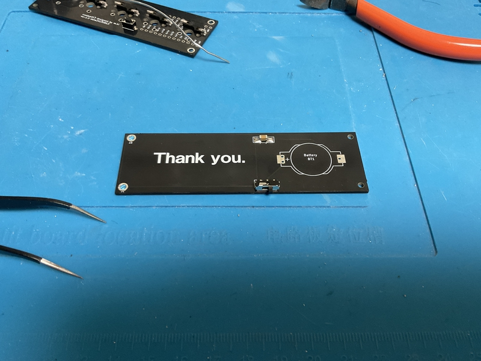

Next, place the battery holder. Solder the terminals on the back side (bottom side).
 
次に、電池ホルダを置きます。裏面（下側）に出た端子にハンダ付けをします。
 

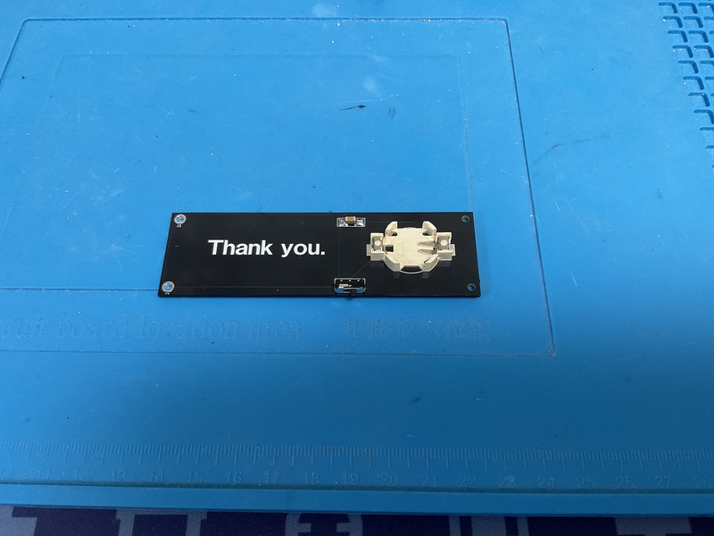

Cut off the terminals protruding from the back using nippers.
 
裏面に出ている端子はニッパーなどで切り取ってください。
 

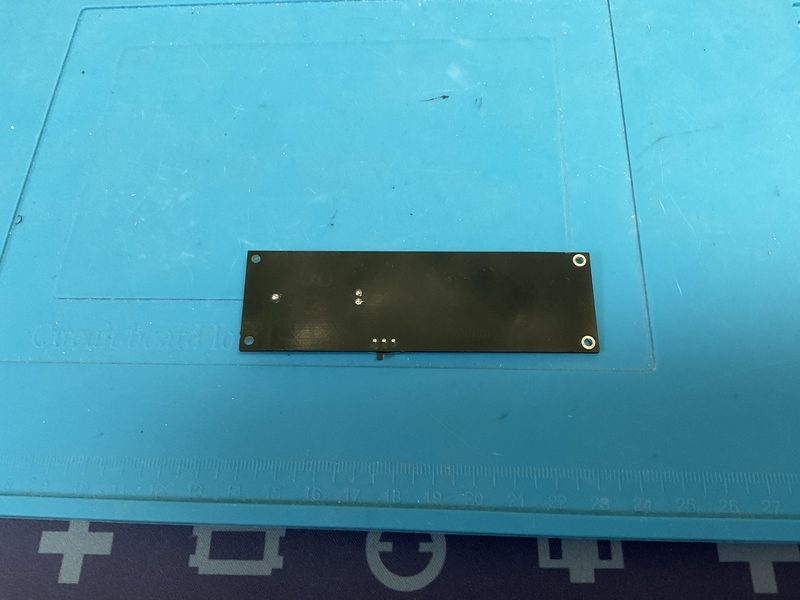

## 5 insert switch

Prepare 5 key switches and insert them into the switch plate.
 
５つのキースイッチを用意して、スイッチプレートに差し込んでください。
 

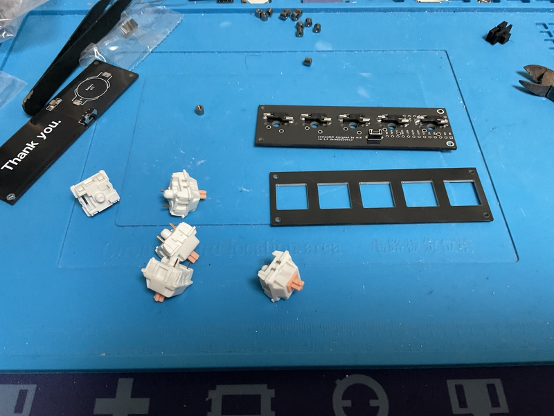

Insert M2 screws (8mm) into the four screw holes from the top of the switch plate, and fix them with M2 spacers (3.5mm) from the bottom. Once you have them, pass them through the screw holes on the board and secure them with M2 spacers (8mm) on the underside of the board.
 
スイッチプレート上側から４つのネジ穴に、M2ネジ（8mm）を挿入して、下側からM2スペーサー（3.5mm）で固定してください。それらができたら、基板のネジ穴に通して基板の下側でM2スペーサー（8mm）で固定してください。
 

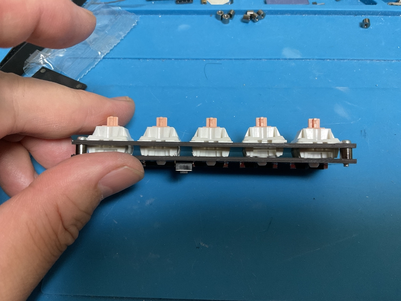

Insert four M2 screws (3mm) from the bottom to secure the bottom plate.Don't forget to insert the CR1632 battery.
 
ボトムプレートは下側からM2ネジ（3mm）４本を挿入して固定してください。CR1632の電池の挿入を忘れずにしてください。
 
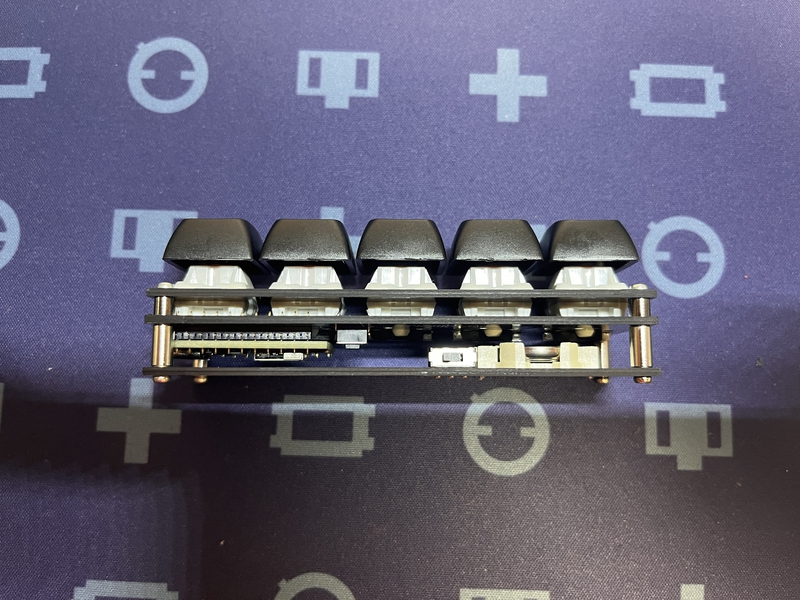

Just attach your favorite keycaps and you're done.
 
お気に入りのキーキャップを装着すれば、完成です。

 

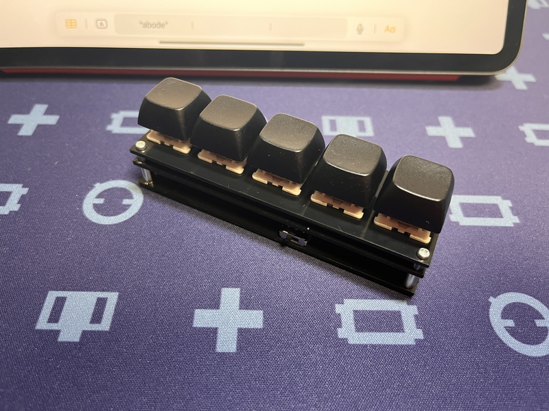

Have a fun keyboard life!
 
楽しいキーボード生活を！